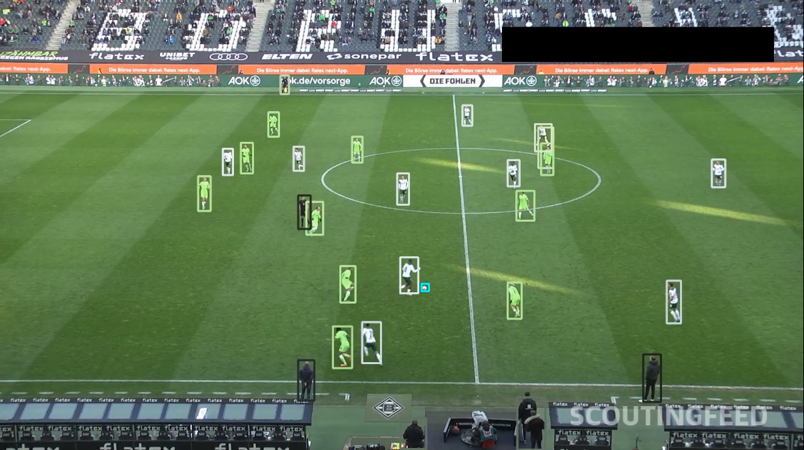
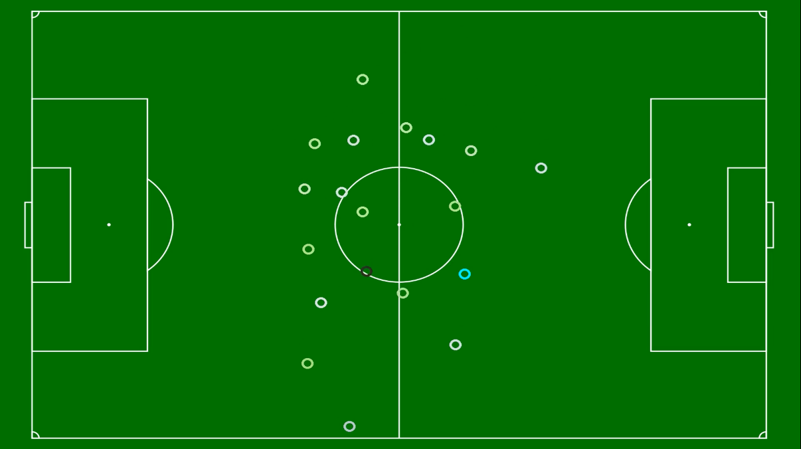

# Soccer players & ball tracker with camera pose estimation

<p>
<em>Key points and lines detection</em></br>

</p>

Goal of this project is to generate a top-view image of a soccer game with the players and the ball on it, potentially to generate statistics of the game.

This requires several computer vision algorithms. Here are described the main steps:
- first detect the main lines and corners on the soccer pitch like the central circle, the lateral lines, the goal lines etc.
- with those key points, find the optimal camera pose and focal length to match the observation with a real soccer pitch with known dimensions.
- On the other hand, use YOLOv5 neural network to detect players and balls on the image.
- Then reproject 2D bounding boxes to the world coordinates and watch the top view. 


## Demo

[](https://www.youtube.com/watch?v=d0JI0GDzkOI&ab_channel=antoinekeller)

## Overview

<p>
<em>camera pose estimation and lines reprojection</em></br>

</p>

<p>
<em>Yolov5 players and ball detection with jersey colors</em></br>

</p>

<p>
<em>Top view images with ball in blue, players with jersey colors, referee in black</em></br>

</p>

## Repo description

```
.
├── images                        # 2 images of sudoku to use with sudoku_cv.py
│   ├── 1.jpeg
│   └── 2.png
├── ocr                           # Optical Character Recognition folder
│   ├── confusion_matrix.png      # used in README.md
│   ├── fonts                     # 10 common fonts for the neural network training
│   │   ├── arial.ttf
│   │   ├── calibri.ttf
│   │   ├── Cambria.ttf
│   │   ├── FranklinGothic.ttf
│   │   ├── futur.ttf
│   │   ├── Garamond.ttf
│   │   ├── Helvetica 400.ttf
│   │   ├── rock.ttf
│   │   ├── times.ttf
│   │   └── verdana.ttf
│   ├── model.h5                  # CNN weights
│   ├── model.json                # CNN description
│   ├── ocr_trainer.py            # The Keras neural network trainer
│   ├── README.md
│   └── test_examples.png         # used in README.md
├── README.md
├── solved.png                    # used in README.md
├── solver.py                     # the core algorithm to solve a sudoku
├── sudoku_cv.py                  # useful script to detect/solve a sudoku on an image
├── sudoku_locator.py             # class that detects and localize the grid
└── sudoku_webcam.py              # the main script that uses the webcam to detect/solve/track the sudoku
```

## Installation

This was tested under Python 3.8.13 in a virutal environment.

Please run:
```
cd camera_pose_estimation_package
pip install -e .
cd ../pitch_tracker_package
pip install -e .
```

## Test

If you are using videos, I recommend to extract them using ffmpeg, for example:

```
ffmpeg -i your_video.mp4 -r 25 image_%03d.png
```

Then, use the yolov5 weights to detect the players and the ball on each image, and save the results in .txt files.

First test the basic tracking and color assignement by running:

```
python team_assigner_with_ball_tracking.py your_images/ your_yolo_labels/
```

If you are satifsied with this, you can build up a top view visualization:

```
python main.py your_images/ your_yolo_labels/
```

If you want to build up a video with images, it s possible too with ffmpeg:

```
ffmpeg -i image_%03d.png -c:v libx264 -vf fps=25 -pix_fmt yuv420p out_video.mp4
```


## Areas of improvements

As you can see, results are not as good as expected, for the following reasons:
- we assume no camera distortion
- we assume that the optical center is perfeclty centered on the camera
- we dont know in advance what is the intrinsic matrix
- we dont know the camera location
- neural network could perform better
- tracking of the ball is very basic
- we assume that the ball is constantly at 0 altitude, so when it s shot in the air, trajectory is very weird

Ideally, we would want to be able to track each player continuously, and follow each of them by its jersey number. Even if one of the players goes out of the field of view of the camera, we would like to recognize him when he is showing up again.

Filtering could be added for object movement (Kalman filter) and camera movement too (way too shaky).

More areas of improvements are detailed in each folder README.md