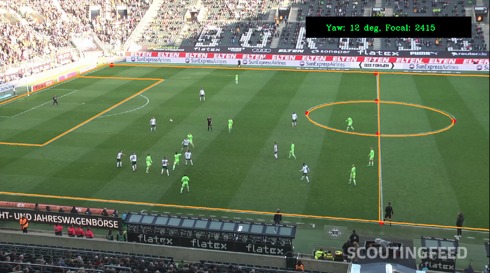

# Camera pose estimation

Based on the key points detected on the soccer pitch, we aim at finding the pose of the camera.
We mainly rely on the Perspective-n-Point algorithm (PnP).

## Assumptions

- we dont know camera location
- we dont know camera intrinsinc matrix
- we assume no distortion
- we let 6 degrees of freedom for the camera, so we are not enforcing any constraint (like no roll, no translation of the camera during a game etc...)

<p>
<em>Camera pose estimation and lines reprojection (orange)</em></br>

</p>

We simultaneously estimate intrinsic/extrinsic camera matrices.


## Install

```
pip install -e .
```

## Folder description

```
.
├── camera_pose_estimation
│   ├── main.py              # Main script to detect key points and solve the PnP
│   ├── projector.py         # Helper with projection and drawing functions
├── README.md
└── setup.py

```

## Test

Run:

```
python camera_pose_estimation/main.py ../images
```

## Areas of improvements

It s quite robust but sometimes a bit shaky, especially between consecutive frames.
- try to use more points in the PnP
- try maybe a PnL (Perspective-n-Lines) approach
- estimate distortion
- use a better SE(3) solver, e.g Ceres to add constraints
- Find a way to filter too big differences between consecutive frames.