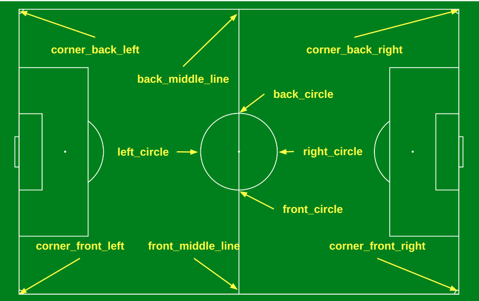
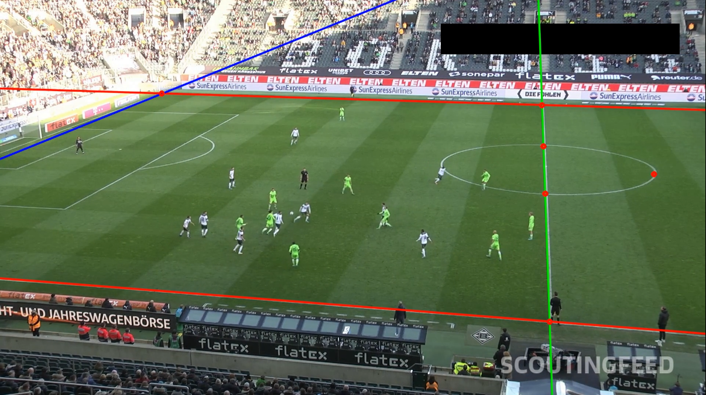

# Pitch tracker

Here we detect the following key points on the image (when there are visible):

<p>
<em>Key points description</em></br>

</p>

We use classical OpenCV functions (Canny, Hough lines etc) to detect them.

## Install

```
pip install -e .
```

## Folder description

```
.
├── pitch_tracker        # Current folder
│   ├── common.py        # Define set of utils functions
│   ├── key_lines.py     # Define key lines class and API
│   ├── key_points.py    # Define key points and API
│   ├── main.py          # Main script to track key points/lines on image
├── README.md
└── setup.py
```

## Test

Run:

```
python pitch_tracker/main.py ../images/
```

<p>
<em>Key points and lines detection</em></br>

</p>


## Areas of improvements

Depending on the sequence, it might happen that the key points are not correclty detected.
I am sure there is room for many improvements there.