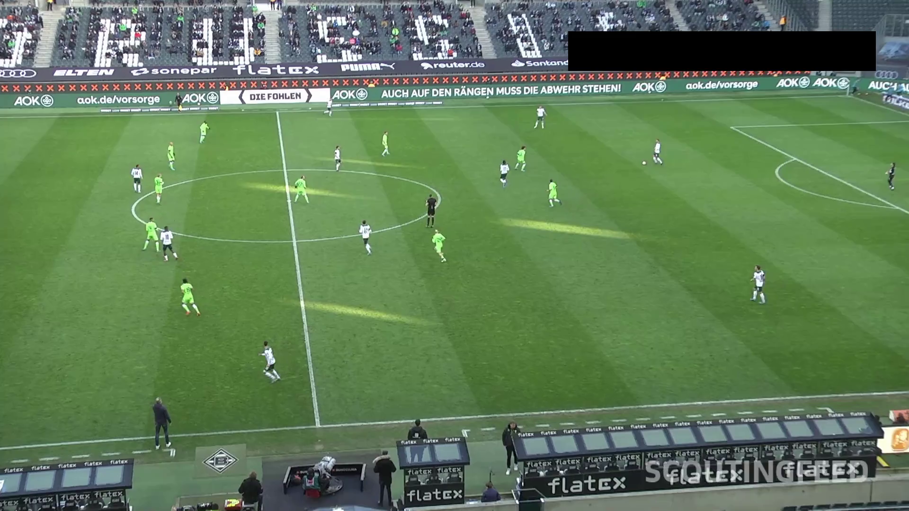
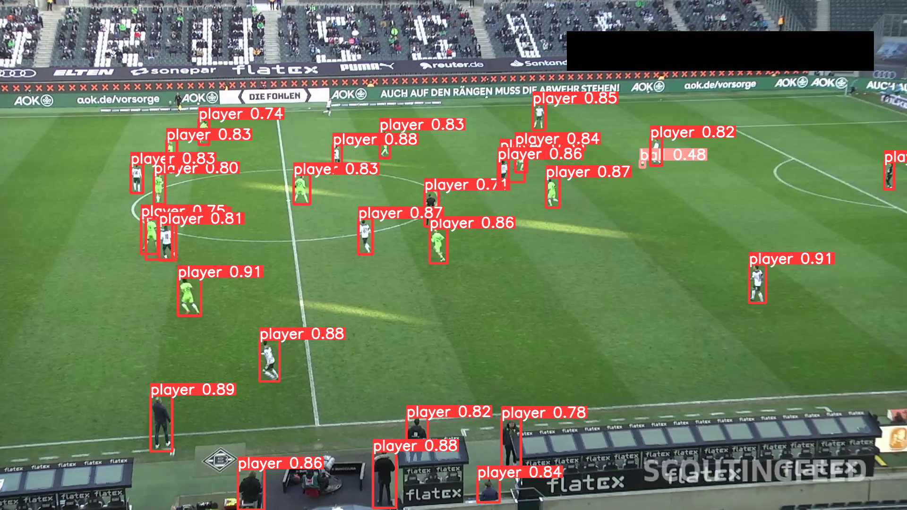

# Players and ball detection

I trained a neural network based on Yolov5 with an annotated dataset coming from this Kaggle challenge https://www.kaggle.com/competitions/dfl-bundesliga-data-shootout/overview

After downloading yolov5, you can try it with:

```
cd yolov5
python detect.py --weights path/to/yolov5_players_and_ball.pt --source path/to/your/images --save-txt
```

<p>
<em>Example image</em></br>

</p>

<p>
<em>Detection with given .pt weights</em></br>

</p>

## Install

See https://github.com/ultralytics/yolov5

## Areas of improvements

Sometimes, it is still difficult to see the ball when it s located in the feet of the players.
There should be something to do with the NMS.
Same for the players, NMS should be set to avoid superposed bounding boxes.